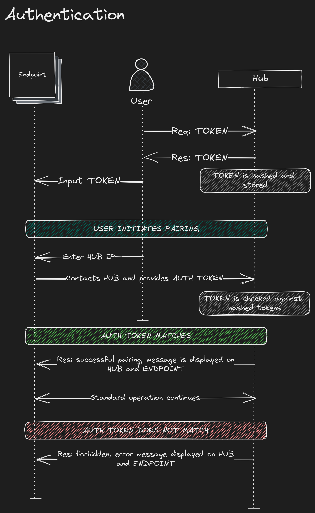

An IoT based, open-source, camera-feed system.

## Features
- TBD

## Installation
- TBD

## Systems Design
The system is designed to be modular, with each component being able to be swapped out for another. It comprises an endpoint software, an API, and a web interface.

The endpoint software is designed to take in the video feed and stream it to the main server, while also dealing with end-user authentication.
The server takes in camera feeds from the endpoints and stores them in a database, while also providing an API for the web interface to use. The server uses one-time token based authentication to ensure that the user is connecting to a known endpoint.
The web interface is designed to be a simple, easy to use interface for the user to view the camera feeds and modify settings. It is a shell for the functions exposed by the API.

All these are modular and can be swapped out with another solution, as long it does not include any breaking changes (unless they are dealt with in the other components as well).


---

## Authentication
The authentication system is a token based system. The server generates a token and stores it in a database. The server's authentication endpoint is registered as an external authentication handler in the MediaMTX server which is being used to take in the RTSP streams. Whenever the endpoint wishes to connect to the server, it sends a request to the MediaMTX server with the token. The MediaMTX server forwards the authentication request to the Hub Server which then checks if the token is valid and if it is, it allows the endpoint to connect to the server. This token is then used to authenticate the endpoint for all future requests.

- [ ] In the future, a function that binds an endpoint to the token may be introduced, to ensure that a token can only be used by the endpoint it was first used by, to prevent token theft.

---
## Databases
The server uses a SQLite database to store data.
Currently, the tokens are stored in a table called `Tokens` with the following schema:
```sql
CREATE TABLE Tokens
(
    Id           integer primary key autoincrement,
    CreationTime integer not null,
    AccessToken  TEXT    not null
);
```
It is being accessed using the Entity Framework Core ORM.